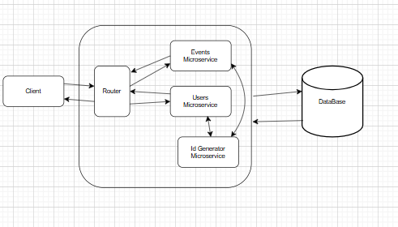
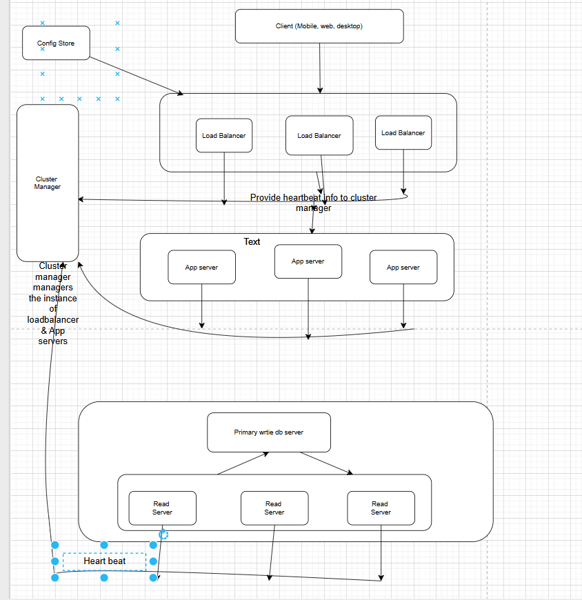

Function Requirements :-
    User Can create a new event in Google Calendar.
    User Can update an existing event in Google Calendar.
    User Can delete an existing event in Google Calendar.
    User Can view all events in Google Calendar.

Low Level Design
   Api EndPoints
    - POST /events - Create a new event
    - PUT /events/{id} - Update an existing event
    - DELETE /events/{id} - Delete an existing event
    - GET /events - View all events
    - GET /events/{id} - View a specific event

Event Table
    - id (Primary Key)
    - title (String)
    - description (String)
    - start_time (DateTime)
    - end_time (DateTime)
    - is_recurring (Boolean)
    - recurrence_rule (String, optional)
    - created_at (DateTime)
    - updated_at (DateTime)
    - parent_event (id of the parent event for recurring events, optional)

Index for Querying
(id),(start_time,end_time),

Event_user Table
    - id (Primary Key)
    - event_id (Foreign Key to Event Table)
    - user_id (Foreign Key to User Table)
    - created_at (DateTime)
    - updated_at (DateTime)

Index for Querying
(event_id), (user_id)

 User Table
    - id (Primary Key)
    - name (String)
    - email (String)
    - created_at (DateTime)
    - updated_at (DateTime)

Simple Architecture

Create Api
   CreateEvent Parameters
    - title (String, required)
    - description (String, optional)
    - start_time (DateTime, required)          ---->  event Service  ---> id_generator
    - end_time (DateTime, required)
    - is_recurring (Boolean, optional, default: false)
    - recurrence_rule (String, optional)
    - description (String, optional)
    
    Output
    Events table 
        123, "Meeting with team", "Discuss project updates", "2023-10-01T10:00:00Z", "2023-10-01T11:00:00Z", false, null, "2023-09-30T12:00:00Z", "2023-09-30T12:00:00Z"
    Events_Users table 
        123,1001
        123,1002
        123,1003

Update Api
    UpdateEvent Parameters
     - id (Integer, required)
     - title (String, optional)
     - description (String, optional)
     - start_time (DateTime, optional)
     - end_time (DateTime, optional)
     - is_recurring (Boolean, optional)
     - recurrence_rule (String, optional)
    
     Output
     Events table 
          123, "Updated Meeting with team", "Discuss project updates and next steps", "2023-10-01T10:00:00Z", "2023-10-01T12:00:00Z", false, null, "2023-09-30T12:00:00Z", "2023-09-30T12:00:00Z"
     Events_Users table remains unchanged

List Events Api 
    By User_id
     ListEvents Parameters
     - user_id (Integer, required)
    
     Output
     Events table 
          123, "Meeting with team", "Discuss project updates", "2023-10-01T10:00:00Z", "2023-10-01T11:00:00Z", false, null, "2023-09-30T12:00:00Z", "2023-09-30T12:00:00Z"
          124, "Project deadline", "Final review before submission", "2023-10-02T09:00:00Z", "2023-10-02T10:00:00Z", false, null, "2023-09-30T12:00:00Z", "2023-09-30T12:00:00Z"
     Events_Users table 
          123,1001
          123,1002
          123,1003
          124,1001
    
     By Event_id
        ListEvent Parameters
        - event_id (Integer, required)
        Output
        Events table 
            123, "Meeting with team", "Discuss project updates", "2023-10-01T10:00:00Z", "2023-10-01T11:00:00Z", false, null, "2023-09-30T12:00:00Z", "2023-09-30T12:00:00Z"    
    
    
Handling Recurrence
    - If is_recurring is true, the recurrence_rule will define how the event recurs (e.g., daily, weekly, monthly).
    - The recurrence_rule can be a string that follows a specific format (e.g., "FREQ=DAILY;INTERVAL=1" for daily recurrence).

Handling Time Zones
    - The start_time and end_time should be stored in UTC format.
    - The API can accept time in different time zones and convert it to UTC before storing it in the database.
    - The API can also return time in the user's preferred time zone.

Strategy : 1  same table as event to store recurring events
    cons - create a bunch of events in advance
    
    

High level design

 

