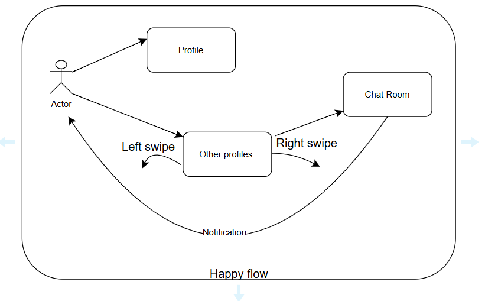

Function Requirements :-
    - User can swipe left/right to a profile.
    - User can set their profile.
    - User can set their preferences.
    - Once there is a match they can chat in chatroom.
    - User can see all the profile nest their location (Nearby can be based on different strategy)
    - User should get notification when there is a match or receive a message. 
    - User matching should be on several factors and scores (like intrest match, location, etc)

Traffic 
    - 50M users
    - 1M active users per day
    - 500k new profile created
    - 1 billion matches per day
    
Photo Storage 
    - 200kb per pic * 6 pic * 50M = 300-600TB storage required
    - 10M photos Uploaded per day

Using Top-Down Approach (observer design pattern)

Happy flow

<<Singleton Class>>
Notificaton Service
    - Map<String, NotificaitonObserver> observers
    - add(Observer, userId)
    - remove(userId)
    - notify(userId, message)
    - notifyAll(message)
                |
                | has 1 to many observer
                v
Notification Observer (abstract class)
    - update(userId, message)
                |
                |
                v
UserNotificaitonObserver
    - updata(message)

User class
    - NotificationObserver notificationObserver     
    - UserProfile profile   (HAS A relation, COMPOSITION)
    - UserPreferences preferences  (HAS A relation, COMPOSITION)
    - Map<String,swipe> history  (HAS A relation)
    - swipe(String userId, Swipe swipe)  (swipe method)
    - isIntrestedin(String userId) (check if user is interested in another user)
    - hasLiked(String userId) (check if user has liked another user)
                |
                | HAS A relation, COMPOSITION
                ^
                v
                |
                |
UserProfile
    - String name
    - String bio
    - Location location (has a relation)
    - int age
    - Gender gender (Enum) ( has a relation)
    - List<Intrest> interests  (has a relation)
    - List<String> pictures
    - display() (display method)

Enum Gender
    - Male
    - Female

Interest class
    - String name
    - String description
    - String category

Location class
    - double latitude
    - double longitude
    - distanceInKm(Location otherLocation)
    - String address
    - display()

User Prefrences 
    - int minAge;
    - int maxAge;
    - double maxDistance;
    - List<String> intrest;
    - List<Gender>  genderIntrests;
     getters & setters

Enum Swipe 
    - LEFT
    - RIGHT

Location service  (has location One to Many with locations)
    - getNearbyUsers(Location location, double maxDistance ) (get nearby users based on location and distance)
    

In this first basicMatches cal the score and then it pass it to intrest then it passes to location matcher.
and further avg score is being calculated.
COR (Chain of Responsibility) Design Pattern

Matcher class
    - calcScore(user1, user2) (calculate score based on interests, location, etc)
  
LocationMatcher
    - calcScore(user1, user2) (calculate score based on location)

IntrestMatcher
    - calcScore(user1, user2) (calculate score based on interests)
BasicMatcher
    - calcScore(user1, user2) (calculate score based on basic matching criteria)

If we want score only for Intrest then we can call Intrest matcher directly. 
For this we are usinn factory design patters to create the ob of matchers

MatcherFactory
    - getMatcher(MatcherType type) (get matcher based on type)

MatcherType (Enum)
    - BASIC
    - INTEREST
    - LOCATION

ChatRoom class
    - String id;
    - List<String> participantIds;
    - List<Message> messages;
    - showAllMessages() (show all messages)
                |
                | has 1 to many
                v
Message class
    - String senderId;
    - String content;
    - Date timestamp;
    

Dating app
   - has 1 to many chatrooms
   - has 1 to many users 
   - List<ChatRoom> chatRooms
   - List<User> users
   - setMatchers()
   - swipe(userid,targetUserid, swipe)

